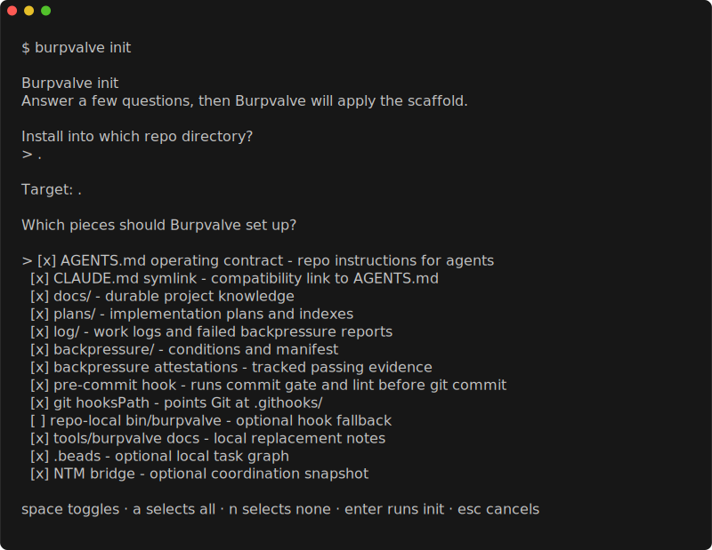
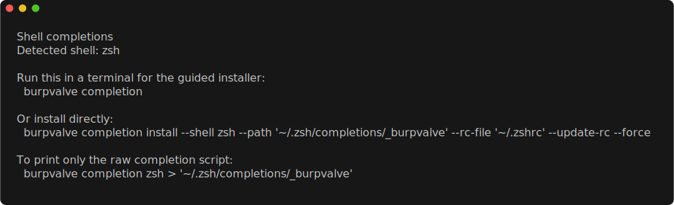

# burpvalve


Burpvalve installs repo-local backpressure for coding agents: shared operating
contracts, standard project folders, a git hook, verifier evidence, lint
execution, and a fail-closed commit valve.

Agents build pressure. Burpvalve makes them earn the release.

## Install

Use a pinned published release tag:

```bash
version="v0.2.1"
tmp="$(mktemp -d)"

curl -fsSL "https://raw.githubusercontent.com/clicksopendoors/burpvalve/${version}/install.sh" \
  -o "$tmp/install-burpvalve.sh"

less "$tmp/install-burpvalve.sh"
chmod +x "$tmp/install-burpvalve.sh"

bash "$tmp/install-burpvalve.sh" \
  --repo clicksopendoors/burpvalve \
  --version "$version" \
  --skills-dir "$HOME/skills" \
  --bin-dir "$HOME/.local/bin"

export PATH="$HOME/.local/bin:$PATH"
burpvalve --version
```

Release packages are built for Linux and macOS on amd64 and arm64. Do not use
Go's module installer; the public install path is the release package and
installer.

This branch documents the v0.3.0 public source snapshot. Tagged v0.3.0 release
archives are separate from this snapshot and are not implied by the install
example above.

## The Problem

Coding agents can write code, declare it done, and hand the pressure to a human
reviewer. The human becomes the compiler, tester, QA pass, release manager, and
risk officer.

Burpvalve changes that loop. The agent writes code, the repo refuses weak work,
the agent fixes the problem, and the human reviews cleaner artifacts.

Human judgment stays in the loop. Burpvalve reduces the amount of review spent
on failures a tool, test, type checker, reviewer agent, browser check, or commit
gate could have shown the agent directly.

## What Burpvalve Does

| Surface | What it gives the repo |
| --- | --- |
| Operating contract | `AGENTS.md`, optional Claude route, and standard instructions for agents. |
| Project scaffold | `docs/`, `plans/`, `log/`, `backpressure/`, hooks, and optional `.beads/` setup. |
| Commit valve | `burpvalve commit` refuses staged work without matching verifier evidence. |
| Gate runner | `burpvalve gate run` executes exact prepared handoffs and journals the ceremony. |
| Evidence ledger | Passing seals under `backpressure/attestations/` and blocked reports under `log/backpressure/failed/`. |
| Lint runner | Exact `lint_commands` from `backpressure/manifest.yaml`, with honest `not_enforced` output when none exist. |
| CI audit | `burpvalve ci` validates staged or committed attestation evidence. |
| Verifier packets | `burpvalve verifier prompts` and `verifier begin/submit` package and merge read-only verifier cells. |
| Lane commits | `--lane` binds orchestrator-authorized multi-bead payloads to explicit rationale and authorization metadata. |
| PXPACK packets | `burpvalve pxpack` builds optional orchestrator context packets with factsheets, source maps, and stale checks. |
| Orchestrator toolbox | The Claude orchestrator skill ships gate choreography, polling helpers, Spark rituals, and role-split references. |
| Agent prompts | `burpvalve prompts` exposes canonical orchestration prompts from the installed binary. |
| Beads helpers | `burpvalve beads preflight`, `drift`, and `close` help close Beads-backed work through the valve. |

## First Run In A Target Repo

```bash
burpvalve setup --json
burpvalve init
git add AGENTS.md CLAUDE.md docs plans log backpressure .githooks
burpvalve commit --feature bootstrap
```

For partial setup:

```bash
burpvalve init --no-beads --no-ntm
burpvalve init AGENTS.md CLAUDE.md hooks
burpvalve repair AGENTS.md
burpvalve repair CLAUDE.md --no-claude-symlink
```

Agents should prefer JSON or robot surfaces when applying known mutations:

```bash
burpvalve setup --json
burpvalve init --force --json --no-beads --no-ntm
burpvalve repair --force --json hooks
burpvalve lint --json | burpvalve explain --json -
```

## The Commit Loop

After `burpvalve init`, the repo hook runs:

```bash
burpvalve commit
burpvalve lint
```

The valve binds evidence to the exact staged payload. A normal agent workflow
looks like this:

```bash
git add cmd/app/main.go cmd/app/main_test.go

burpvalve verifier begin --feature br-123 --json
burpvalve verifier prompts --feature br-123 --json

# Send the packets to real read-only verifiers.
# Merge their replies into the responses file.
burpvalve verifier submit --responses log/backpressure/responses/<hash>.json \
  --condition lint-rules \
  --verdict pass \
  --evidence "go test ./... passed"

burpvalve commit --feature br-123 --responses log/backpressure/responses/<hash>.json
git add backpressure/attestations/<staged-payload-hash>.json
git commit -m "feat: deliver br-123"
```

If any enabled condition is missing, stale, failed, unknown, malformed, or
unsupported by its verifier policy, Burpvalve writes a blocked report instead of
letting the commit through.

## Orchestrated Gate Work

Burpvalve v0.3.0 adds the surfaces that proved useful in the multi-agent
release run: exact gate handoffs, lane commits, context packets, and a shipped
orchestrator toolbox.

### Gate handoffs

Use `burpvalve gate run` when an orchestrator has already prepared the gate
handoff. The handoff names the expected `HEAD`, staged paths, feature or lane
binding, responses file, tests, commit message, bead close/sync intent, and any
authorized reservation cleanup.

```bash
burpvalve gate run --dry-run \
  --handoff log/backpressure/gate-runs/<id>-handoff.json --json
burpvalve gate run \
  --handoff log/backpressure/gate-runs/<id>-handoff.json --yes --json
```

The runner stages only the declared paths, checks hashes, refuses stale
responses or verifier disagreement, runs the same attestation loop as
`burpvalve commit`, and journals the outcome. In v1 it does not push; if the
handoff requests publication, the journal records the exact `git push` command
for an orchestrator to review and run.

### Lane commits

Lane mode covers the narrow case where an orchestrator authorizes one atomic
payload to close multiple Beads issues. The verifier round and commit command
must repeat the same lane id, bead ids, rationale, authorization reference, and
authorizer.

```bash
burpvalve verifier begin --lane --lane-id declared-lane-aj41 \
  --bead br-123 --bead br-456 \
  --lane-rationale "same orchestrator-authorized lane" \
  --lane-authorization-ref "Agent Mail 4000" \
  --authorized-by BronzeDeer --json

burpvalve commit --lane --lane-id declared-lane-aj41 \
  --bead br-123 --bead br-456 \
  --lane-rationale "same orchestrator-authorized lane" \
  --lane-authorization-ref "Agent Mail 4000" \
  --authorized-by BronzeDeer \
  --responses log/backpressure/responses/<hash>.json
```

Tracker exports are checked against the lane. If `.beads/issues.jsonl` includes
changed issue ids outside the declared beads, Burpvalve blocks until the export
is narrowed or the lane is redeclared by the orchestrator.

### PXPACK orchestrator context

`burpvalve pxpack` builds optional PXPIPE-backed context packets for dense
orchestrator briefings. Burpvalve owns the safety contract: factsheets,
source maps, manifest hashes, stale checks, sensitive-input preflight, and the
validation gate that decides whether a packet workflow is good enough to
recommend.

```bash
burpvalve pxpack --orchestrator \
  --out backpressure/pxpipe-packets/orchestrator-bootstrap --json
burpvalve pxpack --orchestrator \
  --check backpressure/pxpipe-packets/orchestrator-bootstrap --json
burpvalve pxpack validate \
  --fixture cmd/burpvalve/testdata/pxpack-validation-safe.json --json
```

PXPIPE remains an image-lane renderer only. Live authority stays in the task
brief, source files, verifier packets, and response files.

### Orchestrator toolbox and scripts

The packaged Claude orchestrator skill now includes reusable references for
gate choreography, verifier fanout, lane declarations, PXPACK use, NTM pane
wake discipline, and the orchestrator toolbox. It also ships `poll_worker.py`
and `poll_round.py` templates so worker liveness and verifier-response polling
use a consistent method instead of ad-hoc terminal watching. Spark
gate-operator templates cover low-effort ceremony execution from exact
handoffs.

## Vocabulary

The full glossary lives in [`docs/vocabulary.md`](docs/vocabulary.md).

| Term | Meaning |
| --- | --- |
| Backpressure | Checks, gates, reviews, and evidence requirements that keep agents from self-certifying weak work. |
| Valve | The fail-closed commit gate. |
| Burp | A real gate refusal; when the valve burps a commit back, it refused the staged work. |
| Seal | A Burpvalve attestation, the evidence artifact written for checked work. |
| Attestation | The formal evidence record and schema; seal and attestation are interchangeable in prose. |
| Work unit | The atomic thing being checked. |
| Feature | The stable CLI and schema binding term for an existing work unit payload, including `--feature` and feature JSON fields. |
| Bead | A Beads/`br` tracker issue, one possible tracker-backed work unit. |

## Why The Name

A burp valve, also called a bleeder, vent, or relief valve, releases trapped
air or excess pressure from a closed system. Agent work has a similar pressure
problem, but it often runs backward. An agent under uncertainty can vent
pressure by handing work back too early: "done", "needs review", "tests
skipped", or "should work." The agent is relieved, but the human reviewer
absorbs the pressure.

Burpvalve puts that pressure back near the artifact. It creates the repo
contract, makes expected checks visible, records evidence, and refuses commits
that have not crossed the declared gates.

## What `burpvalve init` Installs

In a terminal, `init` opens a Bubble Tea setup flow. In scripts, `--json`,
explicit targets, and skip flags run directly. Set `NO_TUI=1` to skip terminal
UI prompts.



| Piece | Purpose |
| --- | --- |
| `AGENTS.md` | Canonical repo operating contract for agents. |
| `CLAUDE.md -> AGENTS.md` | Optional compatibility route for Claude Code. |
| `ORCHESTRATOR.md` | Optional orchestrator contract when that target is selected. |
| `.beads/` | Optional local issue graph through `br` from `beads_rust`. |
| `ntm quick` | Optional registration with NTM for multi-agent coordination. |
| `docs/`, `plans/`, `log/` | Durable knowledge, plans, and run evidence. |
| `backpressure/` | Condition files, manifest, and attestation directory. |
| `.githooks/pre-commit` | Thin hook that runs `burpvalve commit` and `burpvalve lint`. |
| `bin/burpvalve` | Optional repo-local fallback for unusual hook PATH environments. |
| `tools/burpvalve/` | Local notes for source-backed replacement workflows. |

`setup` reports what is missing without changing files. `repair` restores
missing generated pieces without overwriting project knowledge.

## Commands

Global flags:

```bash
--color auto|always|never
--robots
--json
--target /path/to/repo
```

### `burpvalve setup`

Inspect a target repo without changing files.

```bash
burpvalve setup
burpvalve setup --json
burpvalve setup --target /path/to/repo --json
```

### `burpvalve init`

Create missing scaffold files, configure the hook, initialize optional Beads,
and register optional NTM coordination.

```bash
burpvalve init
burpvalve init AGENTS.md CLAUDE.md
burpvalve init log attestations
burpvalve init hooks
burpvalve init --no-beads --no-ntm
burpvalve init --repo-bin
```

Useful targets include `AGENTS.md`, `CLAUDE.md`, `docs`, `plans`, `log`,
`backpressure`, `attestations`, `beads`, `ntm`, `hooks`, `precommit`,
`hooks-path`, `orchestrator`, `ORCHESTRATOR.md`, and `bin/burpvalve`.

### `burpvalve repair`

Restore missing generated pieces.

```bash
burpvalve repair
burpvalve repair AGENTS.md
burpvalve repair CLAUDE.md --no-claude-symlink
burpvalve repair hooks --json
```

`repair AGENTS.md` appends missing Burpvalve sections to an existing file.
`repair CLAUDE.md` can import an existing regular `CLAUDE.md` into `AGENTS.md`
before replacing it with the configured Claude route.

### `burpvalve commit`

Run the staged-payload valve.

```bash
burpvalve commit
burpvalve commit --feature br-123
burpvalve commit --feature docs-example --bead br-123
burpvalve commit --feature docs-example --bead br-123 --bead br-456 \
  --bead-rationale "same staged payload"
burpvalve commit --lane --lane-id declared-lane-aj41 \
  --bead br-123 --bead br-456 \
  --lane-rationale "same orchestrator-authorized lane" \
  --lane-authorization-ref "Agent Mail 4000" \
  --authorized-by BronzeDeer
burpvalve commit --responses responses.json --agent codex --model gpt-5
```

If one staged payload intentionally closes multiple delivery beads, repeat
`--bead` and include `--bead-rationale`. Without a rationale, Burpvalve refuses
the command instead of normalizing unrelated coupled work.

Lane mode is stricter than a multi-bead commit. It is for an
orchestrator-authorized lane, not worker self-batching, and the lane assertions
must match the hash-bound verifier response file. If `.beads/issues.jsonl` is
staged in a lane, every changed issue id in that tracker export must be named
by `--bead`; otherwise the valve blocks until the extra tracker change is
removed or the lane binding is regenerated with that bead and rationale.

### `burpvalve verifier`

Prepare and submit read-only verifier evidence.

```bash
burpvalve verifier begin --feature br-123 --one-feature \
  --atomicity-message "staged payload maps only to br-123" --json
burpvalve verifier begin --lane --lane-id declared-lane-aj41 \
  --bead br-123 --bead br-456 \
  --lane-rationale "same orchestrator-authorized lane" \
  --lane-authorization-ref "Agent Mail 4000" \
  --authorized-by BronzeDeer --json
burpvalve verifier prompts --feature br-123 --json
burpvalve verifier submit --responses log/backpressure/responses/<hash>.json \
  --condition dry \
  --verdict pass \
  --evidence "reviewed staged payload for duplication"
burpvalve verifier doctor --json
```

`verifier prompts` is read-only. It packages staged paths, condition files,
verifier policy, authorization language, and response schema; it does not spawn
agents or claim verification happened.

`verifier begin --lane` writes `binding.lane_binding` into the responses file.
Later `commit --lane` must repeat the same lane id, bead ids, rationale,
authorization ref, and authorizer.

### `burpvalve gate run`

Run the fail-closed gate ceremony from a prepared handoff.

```bash
burpvalve gate run --dry-run --handoff log/backpressure/gate-runs/<id>-handoff.json --json
burpvalve gate run --handoff log/backpressure/gate-runs/<id>-handoff.json --yes --json
printf '{"handoff_path":"log/backpressure/gate-runs/<id>-handoff.json","confirm":true}' \
  | burpvalve gate run --robots
```

`gate run` is a mechanical runner, not a verifier. The handoff must name exact
stage paths, the expected `HEAD`, commit message, feature or lane binding,
responses file, bead close/sync intent, and any authorized release or wake
cleanup. The command stages only handoff paths, compares hashes, stops on
dirty index, stale responses, verifier disagreement, failing tests, or stale
`HEAD`, then runs the same `burpvalve commit` attestation loop used by the
hook.

In v1, `gate run` does not push. When publication is requested it writes the
exact `git push <remote> <branch>` command into the journal for an
orchestrator to run after reviewing the completed local commit. If the handoff
authorizes Agent Mail cleanup, the release phase may release matching file
reservations and records that outcome in the journal.

### `burpvalve pxpack`

Build optional PXPIPE context packets for orchestrators.

```bash
burpvalve pxpack --orchestrator \
  --out backpressure/pxpipe-packets/orchestrator-bootstrap --json
burpvalve pxpack --orchestrator \
  --check backpressure/pxpipe-packets/orchestrator-bootstrap --json
burpvalve pxpack validate \
  --fixture cmd/burpvalve/testdata/pxpack-validation-safe.json --json
```

`pxpack` is a context aid, not an evidence system. PXPIPE renders only the
image lane. Burpvalve owns `factsheet.txt`, `source-map.md`, and
`manifest.json`; the renderer's factsheet and manifest are telemetry only.
Never treat image pages, OCR, or PXPIPE metadata as verifier evidence,
instruction authority, or a source for executable commands.

Generated packet directories use this layout:

```text
backpressure/pxpipe-packets/<packet-id>/
  manifest.json
  prompt.txt
  factsheet.txt
  source-map.md
  page-001.png
  renderer/
```

`factsheet.txt` carries exact anchors such as command strings, paths, ids, and
hashes. `source-map.md` tells the orchestrator which source file to re-read
before executing, approving, or quoting anything. `manifest.json` records
Burpvalve-computed source-content hashes and output hashes; `pxpack --check`
fails closed when any source or packet output changes.

Do not put these inputs in a packet: credentials, private keys, tokens,
environment dumps, private IP addresses, private infrastructure details,
active response files, verifier evidence, exact legal/compliance text that must
be quoted, or any rule that the agent must obey as live authority. Keep
`AGENTS.md`, backpressure condition files, current user dispatch, staged hashes,
and active verifier packets live in the prompt or task brief.

`pxpack validate` scores the required A/B gate before templates may recommend
packet mode. The packet arm must be at least as safe as plain text for missed
exact strings, invented facts, source re-read discipline, and decision quality,
and it must show a cost, latency, or operator-focus benefit.

### `burpvalve lint`

Run executable lint commands declared in `backpressure/manifest.yaml`.

```bash
burpvalve lint
burpvalve lint --json
burpvalve lint init --preset go --json
burpvalve lint init --preset node-astro --json
```

Prose in `backpressure/lint-rules.md` is a policy wishlist until represented by
exact `lint_commands` entries in the manifest.

### `burpvalve ci`

Validate staged or committed attestation evidence.

```bash
burpvalve ci
burpvalve ci --commit HEAD
burpvalve ci --commit 92a8e17 --feature burpvalve-oxp-ci-audit
```

With `--commit`, `--feature` is an assertion against the committed attestation
feature. It does not reshape the historical diff.

### `burpvalve hash`

Show the staged payload hash and staged path accounting.

```bash
burpvalve hash --staged
burpvalve hash --staged --json
```

Generated evidence JSON under `backpressure/attestations/` and
`log/backpressure/failed/` is excluded from the payload hash but still reported
as staged evidence.

### `burpvalve prompts`

Render canonical workflow prompts from the installed binary.

```bash
burpvalve prompts list
burpvalve prompts show commit-choreography --var bead=br-123
burpvalve prompts show verifier-bootstrap \
  --var agent=VerifierName \
  --var project_key=/path/to/repo \
  --var orchestrator=OrchestratorName
```

Prompt names are a public API. Exported prompt files are local copies; the
embedded prompt bank remains authoritative.

### `burpvalve beads`

Plan and execute Beads-backed delivery through the same valve.

```bash
burpvalve beads preflight br-123 --json
burpvalve beads drift --json
burpvalve beads close br-123 \
  --feature br-123 \
  --responses log/backpressure/responses/<hash>.json
```

`beads preflight` is read-only. `beads close` is a journaled state machine that
closes beads, syncs `.beads/issues.jsonl`, stages tracker state, runs the
valve, stages the generated attestation, revalidates, and commits only after
the gate accepts the final staged payload.

### `burpvalve attestations`

Browse and query passing seals and blocked reports.

```bash
burpvalve attestations
burpvalve attestations list --json
burpvalve attestations list --bead br-123 --json
burpvalve attestations show backpressure/attestations/<hash>.json --json
burpvalve attestations latest --status blocked --json
```

### `burpvalve explain`

Turn structured output or evidence files into recovery instructions.

```bash
burpvalve setup --json | burpvalve explain -
burpvalve lint --json | burpvalve explain --json -
burpvalve explain log/backpressure/failed/<file>.json
burpvalve explain backpressure/attestations/<file>.json
```

### `burpvalve account payload`

Report staged-path ownership from explicit C1 records. Beads context is
display-only; it never creates ownership claims by itself.

```bash
burpvalve account payload --json
burpvalve account payload --ownership-file ownership.json --include-beads --json
```

### `burpvalve completion`

Install or verify shell completion and command PATH wiring.

```bash
burpvalve completion
burpvalve completion install --shell zsh --update-rc --force
burpvalve completion verify --shell zsh --json
burpvalve completion zsh > ~/.zsh/completions/_burpvalve
```



### `burpvalve config`

Show and write global or project defaults.

```bash
burpvalve config
burpvalve config --json
burpvalve config init --project --file .burpvalve.seed.json --force --json
printf '{"scope":"project","confirm":true,"config":{"schema_version":1,"defaults":{"shell":"zsh"}}}' \
  | burpvalve config init --robots
```

## Configuration

Burpvalve reads JSON config before choosing command defaults.

| File | Purpose |
| --- | --- |
| `~/.config/burpvalve/config.json` | Global defaults for skills directory, command path, shell, completion behavior, and setup selections. |
| `.burpvalve.json` | Project override read from the target repo root. |

Example:

```json
{
  "schema_version": 1,
  "defaults": {
    "shell": "zsh",
    "color": "auto",
    "confirm": true,
    "bin_dir": "~/.local/bin",
    "completion": {
      "update_rc": true
    },
    "init": {
      "beads": false,
      "ntm": false,
      "repo_bin": false,
      "orchestrator": "off"
    },
    "repair": {
      "repo_bin": false,
      "orchestrator": true
    }
  }
}
```

Project config overrides global config. `burpvalve config --json` includes
sources so agents can tell where an effective value came from.

## Backpressure Model

Burpvalve starts as a refusal surface and evidence ledger. A condition gets
stronger when it moves from prose to something executable:

1. Prose rule
2. Attestation
3. Command
4. CI gate
5. Structural invariant

Default scaffold conditions:

| Condition | Pressure it adds |
| --- | --- |
| `lint-rules` | Mechanical style, formatting, and static-analysis expectations. |
| `dry` | Duplicated logic, copy-paste branches, and repeated validation. |
| `anti-reward-hacking` | Shortcut behavior that makes visible metrics pass while the real goal fails. |
| `one-function-one-test` | Coverage expectations for changed behavior. |
| `definition-of-done` | Project-specific completion rules. |
| `evidence-log` | Command output, screenshots, preview URLs, CI links, and manual verification notes. |
| `scope-control` | One staged payload, one atomic work unit. |
| `destructive-operations` | Deletes, resets, force pushes, migrations, deploys, spend, and external side effects. |
| `data-integrity` | Migration safety, idempotency, rollback, backups, and state-shape invariants. |
| `security-boundaries` | Auth, secrets, tenant isolation, PII, permissions, and external API safety. |
| `visual-regression` | Screenshots, browser checks, responsive layout, canvas checks, and visual diffs. |
| `performance-budget` | Speed, memory, bundle size, throughput, and benchmark budgets. |
| `autonomy-boundary` | Human approval boundaries and agent authority limits. |

## Architecture

```text
command, hook, or CI
  |
  v
cmd/burpvalve
  |
  +-- setup/init/repair -----> internal/scaffold
  |                              embedded templates
  |                              optional Beads and NTM
  |                              hook and Claude route wiring
  |
  +-- commit/hash/verifier ---> internal/backpressure
  |                              manifest and condition hashes
  |                              staged payload hash
  |                              verifier responses
  |                              attestation or blocked report
  |
  +-- lint/ci/account --------> executable commands,
                                committed evidence audit,
                                staged-path ownership accounting
```

See [`docs/ARCHITECTURE.md`](docs/ARCHITECTURE.md) for the code-level report
with file anchors.

## How It Compares

| Capability | Burpvalve | Plain hooks | CI only | Prompt reminders |
| --- | --- | --- | --- | --- |
| Repo-local agent contract | Yes | Partial | No | Partial |
| Staged-payload evidence binding | Yes | Rare | No, unless custom-built | No |
| Independent verifier provenance | Yes | No | Partial | No |
| Human and agent command surfaces | Yes | Partial | No | No |
| Works before commit leaves the repo | Yes | Yes | No | No |
| Honest `not_enforced` lint state | Yes | Depends on hook | Depends on CI | No |
| Beads delivery closure helpers | Yes | No | No | No |

Use Burpvalve when agents routinely work inside a repo and need structural
pushback before they ask a human to trust the result. Keep CI, tests, lint,
review, scanners, and deployment gates; Burpvalve gives those checks a local
contract and evidence path.

## Verify This Checkout

```bash
go test ./...
make build
VERSION=dev ./scripts/package-skill.sh
jsm validate skill/burpvalve
./bin/burpvalve -h
./bin/burpvalve setup --json
```

Installed package smoke test:

```bash
tmp="$(mktemp -d)"
bash ./install.sh \
  --from-archive dist/burpvalve_$(go env GOOS)_$(go env GOARCH).tar.gz \
  --skills-dir "$tmp/skills" \
  --bin-dir "$tmp/bin" \
  --yes
"$tmp/bin/burpvalve" setup --json
test ! -L "$tmp/bin/burpvalve"
jsm validate "$tmp/skills/burpvalve"
```

## Documentation

| File | Purpose |
| --- | --- |
| [`docs/README.md`](docs/README.md) | Documentation index. |
| [`docs/ARCHITECTURE.md`](docs/ARCHITECTURE.md) | Codebase architecture report. |
| [`docs/CHANGELOG.md`](docs/CHANGELOG.md) | Release and implementation history. |
| [`docs/release-install.md`](docs/release-install.md) | Release package and installer workflow. |
| [`docs/result-contract.md`](docs/result-contract.md) | JSON result and recovery contract. |
| [`docs/vocabulary.md`](docs/vocabulary.md) | Canonical product vocabulary. |
| [`SECURITY.md`](SECURITY.md) | Vulnerability reporting policy. |
| [`THIRD_PARTY_NOTICES.md`](THIRD_PARTY_NOTICES.md) | Redistributed dependency notices. |

## Troubleshooting

### `burpvalve is not on PATH, so the commit hook cannot run`

Install or repair PATH wiring:

```bash
burpvalve completion
burpvalve completion verify --json
```

For hook environments that cannot see the global command, opt into a repo-local
fallback:

```bash
burpvalve repair bin --force
```

### `unknown command "config" for "burpvalve"`

You are running an older binary. Reinstall from the release package or rebuild
locally:

```bash
make build
./bin/burpvalve config --json
```

### `burpvalve lint` reports `not_enforced`

The manifest has no executable lint commands. Add exact commands:

```yaml
lint_commands:
  - id: go-test
    command: go test ./...
    required: true
    paths: ["."]
    timeout_seconds: 120
```

### Commit gate writes an attestation but the commit still fails

Stage exactly the attestation path Burpvalve named, then rerun the commit:

```bash
git add backpressure/attestations/<staged-payload-hash>.json
git commit -m "your message"
```

### Config changes do not affect a repo

Run the config command from the target repo, or pass `--target`:

```bash
burpvalve config --target /path/to/repo --json
```

Project config in `.burpvalve.json` overrides
`~/.config/burpvalve/config.json`.

## Limitations

- Release packages are published for Linux and macOS on amd64 and arm64.
- `burpvalve lint` only executes commands declared in
  `backpressure/manifest.yaml`.
- The default conditions are attestation gates. Projects still need real tests,
  scanners, browser checks, benchmark thresholds, and CI jobs for stronger
  enforcement.
- NTM is optional top-level coordination, not automatic verifier fanout for
  every condition cell.
- Burpvalve is not an OS sandbox, cloud permission boundary, secret scanner, or
  substitute for human review.

## FAQ

### Does Burpvalve replace tests, lint, or CI?

No. It gives those checks a repo-local contract and commit evidence path.
Existing test, lint, type, browser, benchmark, and CI systems remain the real
refusal surfaces.

### Does Burpvalve replace human review?

No. It reduces mechanical review load so humans can focus on strategy, risk,
product judgment, and ambiguity.

### Why ship a binary and a skill?

The skill tells agents how to use Burpvalve. The binary performs the work:
scaffold writes, hook wiring, staged-payload hashing, lint execution, verifier
packet generation, and attestation validation.

### Can I use Burpvalve without Beads or NTM?

Yes. Both are optional. Run:

```bash
burpvalve init --no-beads --no-ntm
```

### Can one payload close multiple beads?

Yes, when the staged payload is genuinely one atomic work unit. Repeat
`--bead` and include `--bead-rationale`; Burpvalve rejects multi-bead commits
without a rationale.

Use `--lane` only when an orchestrator explicitly authorizes a lane that spans
multiple beads. Lane responses and attestations keep `bead_ids` queryable, add
`lane_id` and authorization metadata, and block tracker exports that include
changed issue ids outside the declared lane.

### Why does `feature` still appear in commands and JSON?

`feature` is the stable CLI and schema binding term for the current staged
payload. Product prose can call the thing a work unit, but compatibility
surfaces such as `--feature`, `feature_id`, and `Feature` structs keep their
names.

## Influences And Credit

| Source | Idea Burpvalve uses |
| --- | --- |
| Lucas F. Costa, [Backpressure is all you need](https://www.lucasfcosta.com/blog/backpressure-is-all-you-need) and [`@lucasfcosta/backpressured`](https://github.com/lucasfcosta/backpressured) | Move routine "no" decisions out of the human lane and into automated or agentic feedback loops. |
| Moss, [Don't waste your back pressure](https://banay.me/dont-waste-your-backpressure/) | Human feedback is scarce; do not spend it on failures tools could show the agent. |
| Reuben Brooks, [Structural Backpressure Beats Smarter Agents](https://reubenbrooks.dev/blog/structural-backpressure-beats-smarter-agents/) and [Shen-Backpressure](https://github.com/pyrex41/Shen-Backpressure) | Prefer artifact-level refusal over model trust. |
| Kun Chen, [firstmate](https://github.com/kunchenguid/firstmate) | Agent swarms need isolation, task briefs, evidence, delivery modes, and a human-facing liaison. |
| Dicklesworthstone, [ntm](https://github.com/Dicklesworthstone/ntm), [ru](https://github.com/Dicklesworthstone/repo_updater), and [beads_rust](https://github.com/Dicklesworthstone/beads_rust) | Practical patterns for swarm management, repo automation, tool safety, and local-first issue graphs. |

## Contributions

Issues, bug reports, and focused pull requests are welcome. The maintainer may
adapt, rewrite, or decline submitted changes after review. See
[`CONTRIBUTING.md`](CONTRIBUTING.md) for the contribution policy.

## License

Burpvalve is licensed under the MIT License. Release archives include
`THIRD_PARTY_NOTICES.md` for redistributed dependency notices.
